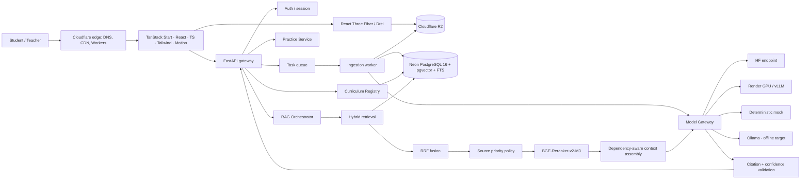

# Lumos — Target Architecture

Confirmed by the 2026-09-04 reconnaissance. Diagram sources in `docs/diagrams/`.

## System



## Layer responsibilities

| Layer | Technology | Responsibility |
|---|---|---|
| Edge | Cloudflare | DNS, CDN, static and asset delivery, Workers where they earn their place |
| Web | TanStack Start, React, TypeScript, Tailwind, selective shadcn/ui, Motion, R3F/Drei | Typed routes and server functions, SSR, the student and teacher experience |
| API | FastAPI (Python) | Auth, orchestration, SSE streaming, typed request/response contracts, background job dispatch |
| Domain services | Python modules behind the API | Curriculum registry, RAG orchestration, practice, ingestion |
| Data | Neon PostgreSQL 16 + pgvector | Relational truth, vectors and full-text search in **one** store |
| Objects | Cloudflare R2 | Curriculum page images, 3D/video assets, exports, uploads |
| Inference | Model Gateway → HF / Render GPU / mock / Ollama | All model access, server-side only |
| Observability | Structured logs, Sentry, AI evaluation logging | Errors, performance, retrieval quality over time |

## Architecture rules

1. **Cloudflare is not the model layer.** Edge for delivery; GPU work stays on GPU-capable infrastructure.
2. **One store.** Postgres + pgvector, so the metadata filter and the vector search execute in a single query. This is also the fix for the legacy defect where filtering happened *after* a global top-k search. Do not add Elasticsearch, Pinecone, Weaviate or a separate BM25 service without evaluation evidence that Postgres is insufficient.
3. **No model provider reaches the browser.** The front end knows the Model Gateway URL and nothing else. No model API key is ever present in a client bundle, and a build-time check asserts it.
4. **Curriculum isolation precedes ranking.** Curriculum / syllabus version / subject / level filters are applied at the SQL boundary, before any similarity computation.
5. **3D is progressive enhancement.** Core navigation and the tutor work without WebGL, and honour `prefers-reduced-motion`.
6. **Availability is data, not markup.** A subject is available only when the curriculum registry says so.

## Retrieval path

```
query
  → intent + curriculum identification
  → registry availability check (unavailable → explicit "not covered", no retrieval)
  → metadata filter (SQL WHERE, before ranking)
  → lexical (Postgres FTS) ‖ semantic (pgvector + BGE-M3)
  → Reciprocal Rank Fusion, k = 60
  → source priority policy (layer retained as a feature, not a hard pre-filter)
  → BGE-Reranker-v2-M3
  → confidence gate (below threshold → refuse)
  → dependency-aware context assembly (topological order over depends_on)
  → Model Gateway
  → citation validation (every reference resolves to a retrieved chunk)
  → answer + sources + confidence
```

RRF is retained because `shikhbo-ai/rag.py` already demonstrates it working over FAISS + BM25, and because rank-based fusion needs no score normalisation between two retrievers whose scales are not comparable. It is the **baseline**: any replacement must beat it on a measured golden set.

Source priority is a **feature carried through fusion and reranking**, not a hard pre-filter — a pre-filter starves the context window when the authoritative layer is thin. Implementation: bounded boost or per-layer quota at context assembly, configurable and measurable.

## Development inference

The 2017 MacBook Air is a client, not an inference host. Default development configuration is remote inference; the deterministic mock provider makes the entire application runnable, and the test suite passable, with an empty `.env` and no GPU anywhere.

## Verified corpus boundary

`CURRICULUM_INVENTORY.md` and `COVERAGE_MATRIX.md` are authoritative. The legacy corpus is **180 records** across SSC English, SSC ICT and one Edexcel IAL Physics specification area. It is partial, unclean, and must never be presented as Lumos curriculum coverage.
